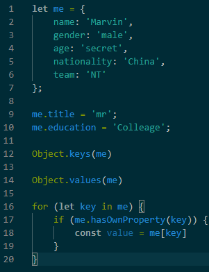
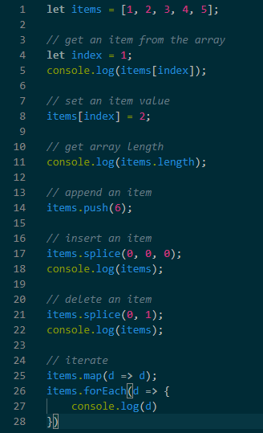

# JS 语法和知识

## JS简介

## JS语法

### 数据类型

- Object 对象
- Array 数组
- String 字符串
- Number 数字
- Boolean 布尔值
- Map 映射
- Set 集合
- null / undefined

#### Object 对象

- 是以 Key-Value 键值对的形式存在的集合
- 键(key)值(String)类型
- 值(Value)可以是任意类型
- 对象的拷贝分为深浅拷贝
    - 深拷贝： 只复制对象内存地址， 类似与指针
    - 深拷贝： 完全克隆， 生成一个新对象



#### Array 数组

- 数组是一个有序排列的集合
- 数组的值可以是任意类型
- 数组的拷贝为深浅拷贝
    - 与对象一致



#### String 字符串

- 字符串是任何由单引号或双引号定义的类型

```js
let str = 'hello world';
```

#### Number 数字

- 数字是任何表示数字的类型

```js
let num = 123;
```

#### Boolean 布尔值

- 布尔值是表示true或fale的类型

```js
let b = true;
```

#### Map 映射

- 键(Key)值(Value)对关系的集合
- 与对象不同的是， 键可以是任何类型

```js
let m = new Map([
    [1, 'first as number'],
    ['1', 'first as number']
])

// get a value from key
m.get(1);

// set a value
m.set(1, 1);

// clear all
m.clear()
```

#### Set 集合

- 相当于不重复的数组

```js
let s = new Set([1, 1, 2]);
```

#### null

- 相当于一个"空"的值
- 表示该值为空

#### undefined

- 表示 "未定义"
- 通常用于比较不存在的属性或值


### 控制流

#### 循环

- while
- for
- Array
    - map
    - forEach

```js
let a = 0;

while (a < 10) {
    a++;
}

for (let i = 0; i < 10; i++) {
    console.log(i);  
}

const arr = [1, 2, 3];

const arr2 = arr.map(d => d + 1);

arr.forEach(d => console.log(d));
```


#### 条件判断

#### 函数

- 定义
- 变量作用域
- 高阶函数
- 闭包
- 特殊对象

##### 函数定义

- 带函数名
    - function funcName(pram) { statement }
    - const funcName = function (param) { statement }
- 不带函数名 （匿名定义）
    - ( function (param) { statement }() )

##### 变量作用域

- 变量定义
    - var, const, let 定义的变量是由作用域的
    - var 定义的变量在各自的函数内部起作用
    - const， let 定义的变量为块级作用域
- 变量提升
    - 扫描整个函数体的语句， 将所有声明变量提升到函数顶部
- 全局作用域
    - 如果不指定 var, const, let 声明关键字定义变量， 该变量被绑定到全局变量window上
- 块级作用域
    - let, const 将作用在for, while 等循环语句里

##### 高阶函数

- 定于
    - 接受另一个函数作为参数的函数被称为高阶函数
- 用途
    - 回调
        - callback
    - 数组操作
        - filter, sort, map, forEach

##### 闭包

- 定义
    - 函数的返回值可以为函数
    - 所有的参数和变量都保存在返回函数中
    - 当调用返回函数时才会执行所有的运算逻辑
- 用途
    - 匿名自执行函数
    - 封装
    - 结果缓存

#### 特殊对象

##### JSON

- JSON, 对象的序列化 / 反序列化操作
- JSON.stringify 序列化
- JSON.parse 反序列化

## JS进阶

### 概览

- 事件循环
- 原型链
- 异步编程
- 浏览器储存
- 跨域
- Webpack 打包

### 事件循环

- 定义： 主线程不断的重复获取执行消息， 再获取执行不断循环的机制被称为事件循环
- 为什么需要事件循环
    - JS 是单线程的
    - 在处理异步操作的时候需要事件循环机制
- 相关概念
    - 堆(Heap): 大块非结构化内存区域， 储存对象， 对象
    - 栈(Stack): 调用栈， 储存该次循环待主程序执行的任务
    - 队列(Queue): 事件队列， 先进先出被推入调用栈中
- 宏任务(Macro Task)和微任务(Micro Task)
- Node.js 事件循环

### 原型链

- 概念
    - prototype
    - __proto__
    - constructor
- 应用场景
    - 继承， 代码复用
- ES6出来后是否需要理解原型链？


### 异步编程

- 回调函数Callback
    - 通过传入回调函数作为参数在函数中异步执行
    - 优点： 简单
    - 缺点： 回调地狱

- Promise
    - ES6 中出现的异步解决方案
    - 可以获取异步操作消息的对象
    - resolve / reject, then / catch
    - 优点： 解决了回调地狱
    - 缺点： 代码可读性不高

- async / await
    - ES8 中出现的异步解决方案
    - 是基于Promise的语法糖， 需要了解Promise相关知识
    - async 返回Promise对象
    - async 函数遇到await时会终止运行， 知道相应的Promise状态变为resolved
    - 优点：解决了Promise代码可读性问题， 代码可读性高
    - 缺点： 多个并行异步操作需要用Promise.all来执行


### 浏览器存储

- Cookies
    - 主要用于与服务端通信
    - 存储量小
- Local Storage
    - 存储量相对于Cookies更大
    - 只能存储字符串
- Session Storage
    - 只存在于当前Session， 关闭浏览器就丢失了
    - 其他与Local Storage一样
- IndexedDB
    - 相当于浏览器上的SQL数据库
    - 更大的储存空间
    - API比较难掌握

### 跨域

- 定义： 客户端与不同源的服务端通信

#### 解决

- CORS
    - 跨域资源共享， 解决跨域请求的方案的成熟方案
- JSONP
    - 基于 <script> 标签具有可跨域特性
    - 只能用于GET请求
- iframe
    - 通过 <iframe> 标签在一个页面展示不同源的页面
    - 通过 PostMessage 进行页面之间的通信
- 反向代理
    - 通过反向代理让客户端与服务端保持同源

### Webpack 打包

-  目的
    - 将不同类型的源文件编译打包成静态文件
- 为什么使用Webpack
    - 前端技术纷繁复杂， 缺乏统一管理
    - 大型项目需要模块化
    - 对于例如JSX， TS之类的新技术需要编译后才能使用
- 编译器
- 插件
- 优化

## 总结

